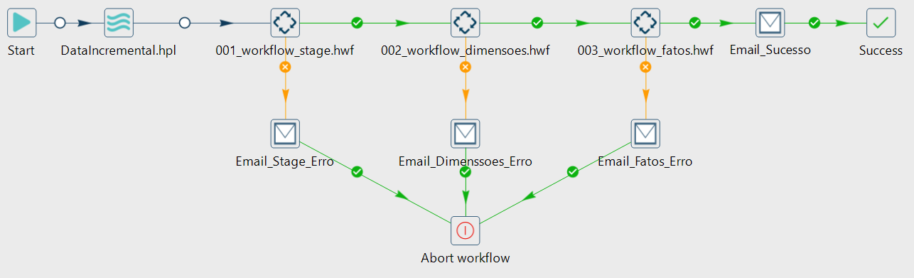
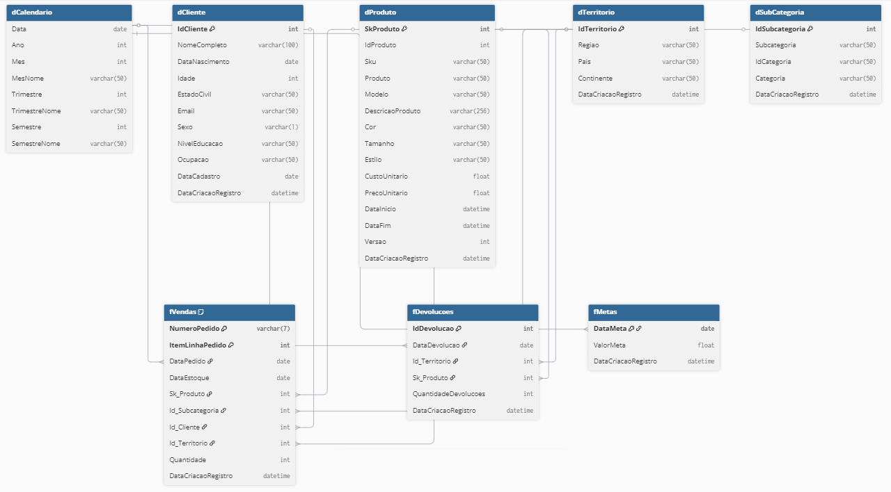

# Pipeline de Dados – Arquitetura Completa

Este repositório documenta a pipeline de dados que eu desenvolvi com foco em extração incremental, padronização dos dados em Stage, modelagem em Data Warehouse e orquestração completa usando Apache Hop.  
A solução contempla também monitoramento, logs detalhados e envio automático de alertas por e-mail para garantir confiabilidade operacional.

---

## 1. Visão Geral da Arquitetura

### 1.1 Componentes principais
Ao longo do projeto, integrei diferentes tecnologias e camadas para montar uma arquitetura sólida e escalável:

- **PostgreSQL + SQL Server** como fontes de dados  
- **Área de Stage** para padronização e tratamento inicial  
- **Data Warehouse** modelado no padrão estrela  
- **Apache Hop** para orquestração dos workflows  
- **Mecanismo de logs e alertas por e-mail**  
- **Processo de carga incremental**, reduzindo tempo e custo de execução  

### 1.2 Fluxo resumido da pipeline
A orquestração principal ficou estruturada da seguinte forma:


<br><br>
```
Start → DataIncremental.hpl  
      → 001_workflow_stage.hwf  
        → (erro) Envio_Stage_Erro → Abort  
      → 002_workflow_dimensoes.hwf  
        → (erro) Envio_Dimensoes_Erro → Abort  
      → 003_workflow_fatos.hwf  
        → (erro) Envio_Fatos_Erro → Abort  
      → Envio_Email  
      → Success
```

Cada etapa possui tratamento de erro isolado com envio automático de e-mail e, caso necessário, interrupção imediata da execução.

---

## 2. Modelagem do Data Warehouse

A modelagem foi construída seguindo o padrão **estrela**, separando **dimensões** (Clientes, Produtos, Calendário, Território, Subcategoria) e **fatos** (Vendas, Devoluções, Metas).

O objetivo foi garantir simplicidade para consultas, boa performance e flexibilidade para análises futuras.




---

## 3. ETL/ELT – Extração, Transformação e Carga

### 3.1 Extração incremental
Implementei a lógica de incremental dentro do workflow **DataIncremental.hpl**, utilizando colunas de auditoria para identificar registros novos ou atualizados.  
Essa etapa coleta dados tanto de **PostgreSQL** quanto de **SQL Server** e entrega tudo para a área de Stage.

### 3.2 Área de Stage
Workflow: **001_workflow_stage.hwf**

Nesta etapa ocorre:
- Padronização de tipos  
- Normalização  
- Tratamentos iniciais  
- Preparação dos dados para as próximas camadas  

Caso ocorram erros, um e-mail é enviado automaticamente e o pipeline é interrompido para evitar propagação de inconsistências.

### 3.3 Carga das Dimensões
Workflow: **002_workflow_dimensoes.hwf**

Aqui realizei:
- Upsert das dimensões  
- Tratamento de versionamento quando necessário (SCD simples)  
- Chaves substitutas  
- Atualizações de registros existentes  

Erros seguem automaticamente para o fluxo de notificação (**Envio_Dimensoes_Erro**).

### 3.4 Carga dos Fatos
Workflow: **003_workflow_fatos.hwf**

Nesta fase fiz:
- Junções entre Stage e Dimensões  
- Conversões de chaves  
- Inserção das linhas finais no fato  

Qualquer falha aciona o fluxo de alerta (**Envio_Fatos_Erro**).

### 3.5 Finalização
Depois que todas as etapas rodam sem erros:
- Um e-mail de sucesso é enviado  
- O pipeline encerra com o status **Success**

---

## 4. Orquestração e Agendamento

Toda a lógica foi implementada no **Apache Hop**, garantindo que as etapas rodem na ordem correta.  
Além disso:

- Cada workflow possui condição de sucesso e de falha  
- Existem caminhos alternativos para interrupção (Abort)  
- O processo pode ser agendado conforme a necessidade do negócio  

Com isso, o fluxo fica protegido contra erros silenciosos e mantém rastreabilidade clara.

---

## 5. Monitoramento e Logs

Durante o desenvolvimento, configurei logs que registram:

- Etapas executadas  
- Tempo de execução  
- Quantidade de registros processados  
- Parâmetros utilizados  
- Mensagens de falha detalhadas  

Os logs permitem auditoria completa e facilitam a identificação de falhas durante a operação diária.

---

## 6. Carga Incremental

A carga incremental foi projetada para:

- Reduzir tempo de execução  
- Minimizar sobrecarga no banco de origem  
- Evitar retrabalho desnecessário  
- Controlar apenas mudanças reais nos dados  

As dimensões utilizam versionamento quando necessário para manter histórico consistente.

---

## Aprendizado

Este projeto consolidou várias habilidades práticas de engenharia de dados que venho desenvolvendo.  
Na prática, aprimorei minha capacidade de:

- Construir pipelines completas ponta a ponta, da extração ao Data Warehouse  
- Trabalhar com múltiplas fontes (PostgreSQL e SQL Server) e integrar ambientes heterogêneos  
- Projetar e implementar cargas incrementais de forma eficiente  
- Estruturar processos ETL resilientes, com logs, detecção de erros e alertas automáticos  
- Utilizar Apache Hop para orquestração modular, com workflows independentes e bem organizados  
- Modelar um Data Warehouse no padrão estrela, pensando na camada analítica  
- Criar mecanismos de monitoramento e recuperação em caso de falha  

Foi um projeto que me deu uma visão completa do ciclo de dados em produção e reforçou várias boas práticas que pretendo manter nos próximos trabalhos.

